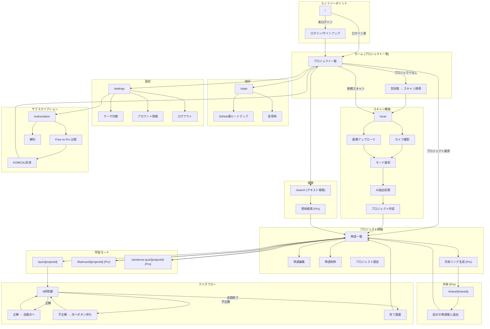
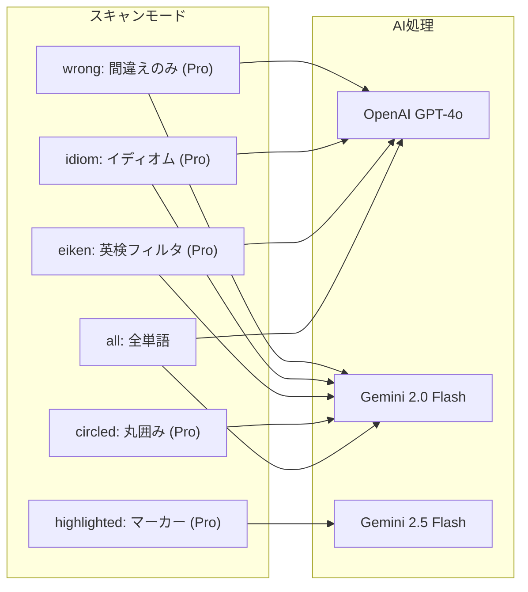
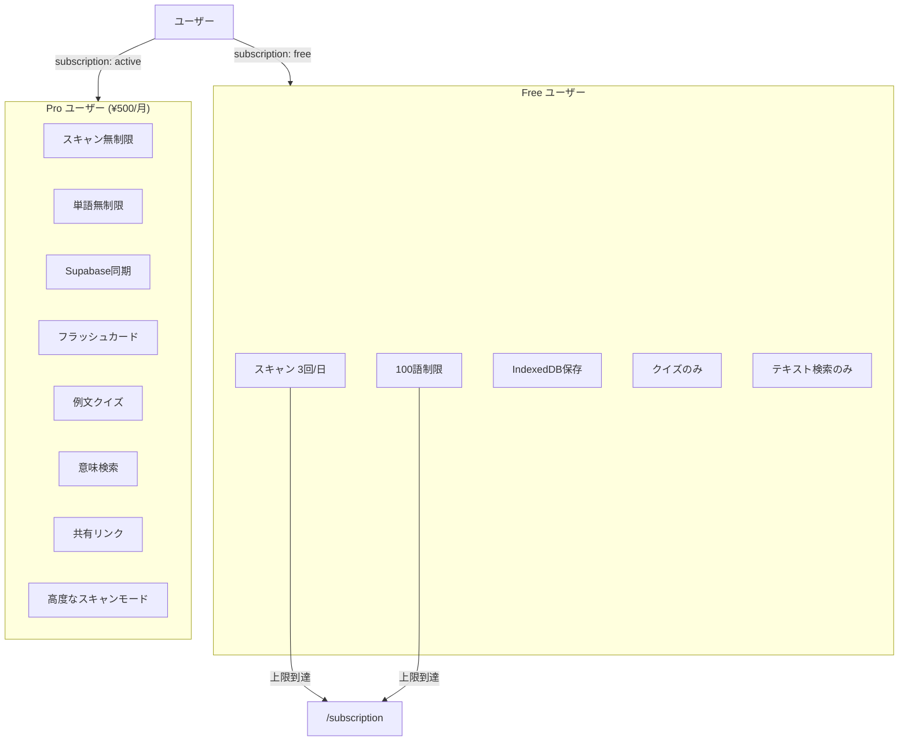
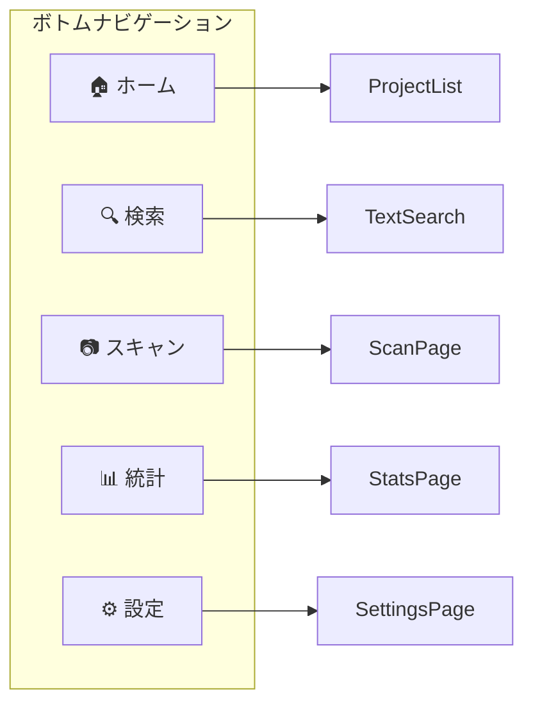

# ScanVocab ユーザーフロー図

## 全体フロー

```mermaid
flowchart TB
    subgraph Entry["エントリーポイント"]
        Landing["/"]
        Login["ログイン/サインアップ"]
    end

    subgraph Home["ホーム (プロジェクト一覧)"]
        ProjectList["プロジェクト一覧"]
        EmptyState["空状態 → スキャン誘導"]
    end

    subgraph Scan["スキャン機能"]
        ScanPage["/scan"]
        CameraCapture["カメラ撮影"]
        ImageUpload["画像アップロード"]
        ModeSelect["モード選択"]
        AIExtract["AI抽出処理"]
        ProjectCreate["プロジェクト作成"]
    end

    subgraph Project["プロジェクト詳細"]
        WordList["単語一覧"]
        WordEdit["単語編集"]
        WordDelete["単語削除"]
        ProjectSettings["プロジェクト設定"]
        ShareLink["共有リンク生成 (Pro)"]
    end

    subgraph Learning["学習モード"]
        Quiz["/quiz/[projectId]"]
        Flashcard["/flashcard/[projectId] (Pro)"]
        SentenceQuiz["/sentence-quiz/[projectId] (Pro)"]
    end

    subgraph QuizFlow["クイズフロー"]
        QuizQuestion["4択問題"]
        QuizCorrect["正解 → 自動次へ"]
        QuizWrong["不正解 → 次へボタン待ち"]
        QuizComplete["完了画面"]
    end

    subgraph Search["検索"]
        TextSearch["/search (テキスト検索)"]
        SemanticSearch["意味検索 (Pro)"]
    end

    subgraph Stats["統計"]
        StatsPage["/stats"]
        Heatmap["GitHub風ヒートマップ"]
        Progress["習得率"]
    end

    subgraph Settings["設定"]
        SettingsPage["/settings"]
        ThemeToggle["テーマ切替"]
        AccountInfo["アカウント情報"]
        Logout["ログアウト"]
    end

    subgraph Subscription["サブスクリプション"]
        SubPage["/subscription"]
        PlanCompare["Free vs Pro 比較"]
        KomojuPayment["KOMOJU決済"]
        SubCancel["解約"]
    end

    subgraph Share["共有 (Pro)"]
        ShareView["/share/[shareId]"]
        ImportProject["自分の単語帳に追加"]
    end

    %% フロー定義
    Landing --> |未ログイン| Login
    Landing --> |ログイン済| ProjectList
    Login --> ProjectList

    ProjectList --> |プロジェクトなし| EmptyState
    EmptyState --> ScanPage
    ProjectList --> |新規スキャン| ScanPage
    ProjectList --> |プロジェクト選択| WordList

    ScanPage --> CameraCapture
    ScanPage --> ImageUpload
    CameraCapture --> ModeSelect
    ImageUpload --> ModeSelect
    ModeSelect --> AIExtract
    AIExtract --> ProjectCreate
    ProjectCreate --> WordList

    WordList --> Quiz
    WordList --> Flashcard
    WordList --> SentenceQuiz
    WordList --> WordEdit
    WordList --> WordDelete
    WordList --> ShareLink

    Quiz --> QuizQuestion
    QuizQuestion --> |正解| QuizCorrect
    QuizQuestion --> |不正解| QuizWrong
    QuizCorrect --> QuizQuestion
    QuizWrong --> QuizQuestion
    QuizQuestion --> |全問終了| QuizComplete
    QuizComplete --> WordList

    Flashcard --> WordList
    SentenceQuiz --> WordList

    ProjectList --> TextSearch
    TextSearch --> SemanticSearch
    SemanticSearch --> WordList

    ProjectList --> StatsPage
    StatsPage --> Heatmap
    StatsPage --> Progress

    ProjectList --> SettingsPage
    SettingsPage --> ThemeToggle
    SettingsPage --> AccountInfo
    SettingsPage --> SubPage
    SettingsPage --> Logout

    SubPage --> PlanCompare
    PlanCompare --> KomojuPayment
    KomojuPayment --> ProjectList
    SubPage --> SubCancel

    ShareLink --> ShareView
    ShareView --> ImportProject
    ImportProject --> WordList
```

## スキャンモード詳細

```mermaid
flowchart LR
    subgraph Modes["スキャンモード"]
        All["all: 全単語"]
        Circled["circled: 丸囲み (Pro)"]
        Highlighted["highlighted: マーカー (Pro)"]
        Eiken["eiken: 英検フィルタ (Pro)"]
        Idiom["idiom: イディオム (Pro)"]
        Wrong["wrong: 間違えのみ (Pro)"]
    end

    subgraph AI["AI処理"]
        OpenAI["OpenAI GPT-4o"]
        Gemini["Gemini 2.0 Flash"]
        GeminiPro["Gemini 2.5 Flash"]
    end

    All --> OpenAI
    All --> Gemini
    Circled --> Gemini
    Highlighted --> GeminiPro
    Eiken --> Gemini
    Eiken --> OpenAI
    Idiom --> OpenAI
    Idiom --> Gemini
    Wrong --> Gemini
    Wrong --> OpenAI
```

## Free vs Pro フロー分岐

```mermaid
flowchart TB
    User["ユーザー"]
    
    subgraph Free["Free ユーザー"]
        FreeScan["スキャン 3回/日"]
        FreeWords["100語制限"]
        FreeLocal["IndexedDB保存"]
        FreeQuiz["クイズのみ"]
        FreeTextSearch["テキスト検索のみ"]
    end

    subgraph Pro["Pro ユーザー (¥500/月)"]
        ProScan["スキャン無制限"]
        ProWords["単語無制限"]
        ProCloud["Supabase同期"]
        ProFlashcard["フラッシュカード"]
        ProSentence["例文クイズ"]
        ProSemantic["意味検索"]
        ProShare["共有リンク"]
        ProModes["高度なスキャンモード"]
    end

    User --> |subscription: free| Free
    User --> |subscription: active| Pro

    FreeScan --> |上限到達| SubPage["/subscription"]
    FreeWords --> |上限到達| SubPage
```

## ナビゲーション構造

```mermaid
flowchart LR
    subgraph BottomNav["ボトムナビゲーション"]
        NavHome["🏠 ホーム"]
        NavSearch["🔍 検索"]
        NavScan["📷 スキャン"]
        NavStats["📊 統計"]
        NavSettings["⚙️ 設定"]
    end

    NavHome --> ProjectList
    NavSearch --> TextSearch
    NavScan --> ScanPage
    NavStats --> StatsPage
    NavSettings --> SettingsPage
```

---

*生成日: 2026-02-01*
*ステータス: 現状の実装に基づく*
