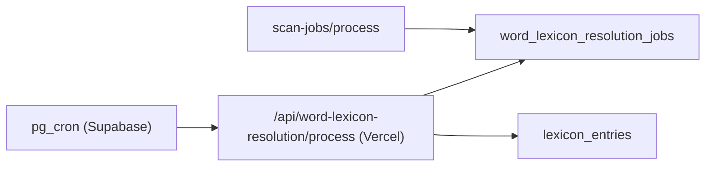

# Nightly Master Lexicon Cron Runbook

## 0. Scope
- 対象: `nightly-word-lexicon-resolution` と、その worker route `/api/word-lexicon-resolution/process`
- 目的: scan 由来の未解決語を `master` lexicon へ反映し、翌日以降の scan を高速化する
- 非対象: `nightly-lexicon-example-backfill` の SQL 更新ロジック自体

## 1. 症状
- 同じ画像を翌日に scan しても完了速度が変わらない
- `word_lexicon_resolution_jobs` に `pending` が溜まり続ける
- `lexicon_entries.updated_at` が夜間に進まない
- `/api/word-lexicon-resolution/process` が 401 を返す

確認 SQL:

```sql
select status, count(*) as jobs, coalesce(sum(word_count), 0) as words
from public.word_lexicon_resolution_jobs
group by status
order by status;
```

## 2. 構成



- `scan-jobs/process` は未解決語を `word_lexicon_resolution_jobs` に enqueue する
- nightly cron は 03:30 JST に worker route を叩く
- worker route は 1 回で最大 10 job を処理する

## 3. Secret 設定
### 3.1 Vercel
- `INTERNAL_WORKER_TOKEN`
- `SUPABASE_SERVICE_ROLE_KEY` は互換 fallback として残す

### 3.2 Supabase Vault
- `app_base_url`
- `internal_worker_token`
- `supabase_service_role_key` は fallback として残す

登録例:

```sql
select vault.create_secret('https://your-app.example.com', 'app_base_url');
select vault.create_secret('your-internal-worker-token', 'internal_worker_token');
```

重要:
- token の前後空白、末尾改行を入れない
- Vercel と Supabase Vault で同じ `INTERNAL_WORKER_TOKEN` を使う

## 4. 復旧手順
1. Vercel production に `INTERNAL_WORKER_TOKEN` を設定する
2. Supabase Vault に `internal_worker_token` を設定する
3. 最新 migration を本番へ適用する

```bash
npx supabase db push
```

4. 本番 deploy を反映する
5. worker route の認証疎通を確認する

```bash
curl -sS -X POST "https://your-domain.com/api/word-lexicon-resolution/process" \
  -H "Content-Type: application/json" \
  -H "Authorization: Bearer ${INTERNAL_WORKER_TOKEN}" \
  -d '{"jobId":"00000000-0000-0000-0000-000000000000"}'
```

期待値:
- 401 ではない
- 通常は `{"success":true,"processed":0}` が返る

## 5. Backlog 手動解消
- 現状の worker は 1 回で最大 10 job を処理する
- backlog が 81 job なら、9 回前後の実行を見込む

実行コマンド:

```bash
curl -sS -X POST "https://your-domain.com/api/word-lexicon-resolution/process" \
  -H "Content-Type: application/json" \
  -H "Authorization: Bearer ${INTERNAL_WORKER_TOKEN}" \
  -d '{}'
```

確認 SQL:

```sql
select status, count(*) as jobs, coalesce(sum(word_count), 0) as words
from public.word_lexicon_resolution_jobs
group by status
order by status;
```

途中で `failed` が出ても即停止せず、先に失敗理由を採取する:

```sql
select id, status, attempt_count, error_message, updated_at
from public.word_lexicon_resolution_jobs
where status = 'failed'
order by updated_at desc
limit 20;
```

## 6. 検証
### 6.1 Cron 登録確認

```sql
select jobid, jobname, schedule, command
from cron.job
where jobname = 'nightly-word-lexicon-resolution';
```

### 6.2 実行結果確認

```sql
select id, status, word_count, created_at, processing_started_at, completed_at, updated_at
from public.word_lexicon_resolution_jobs
order by created_at desc
limit 30;
```

### 6.3 master 更新確認

```sql
select id, headword, pos, translation_source, updated_at
from public.lexicon_entries
order by updated_at desc
limit 20;
```

### 6.4 REST 確認

```bash
curl -sS "${NEXT_PUBLIC_SUPABASE_URL}/rest/v1/word_lexicon_resolution_jobs?select=id,status,created_at,completed_at&order=created_at.desc&limit=20" \
  -H "apikey: ${SUPABASE_SERVICE_ROLE_KEY}" \
  -H "Authorization: Bearer ${SUPABASE_SERVICE_ROLE_KEY}"
```

## 7. ロールバック
1. Vercel の `INTERNAL_WORKER_TOKEN` を旧値へ戻す、または削除して `SUPABASE_SERVICE_ROLE_KEY` fallback を使う
2. Supabase Vault の `internal_worker_token` を旧値へ戻す、または削除する
3. 必要なら nightly cron migration を再適用する

## 8. よくある失敗
- Vercel と Supabase Vault の token が一致していない
- token に末尾改行が混ざっている
- `app_base_url` が preview URL や古い独自ドメインを指している
- deploy は済んだが migration 未適用で cron 定義が古い
- backlog drain を DB 直接更新で済ませて、`lexicon_entries` 更新を飛ばしてしまう

## 9. 完了条件
- `word_lexicon_resolution_jobs` の `pending=0`
- `completed>0`
- `lexicon_entries.updated_at` が復旧日以降に進む
- 翌日の 03:30 JST 後に新しい `completed_at` が確認できる
